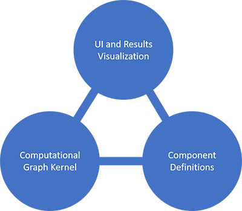

This is my attempt at implementing a basic visual programming interface in JavaScript.

As the logo clearly depicts, the name of this project is about your average industrial 
hopper full of grass. The title is not a reference to any other visual programming 
interface.

As the image below shows, the module is split into three parts:
* Computational Graph Kernel
* Component Definitions
* User Interface and Results visualization

## Computational Graph Kernel
This part is implemented in the "components.js" file. This contains the logic of how the
components connect to each other, how the data flows through the graph, etc. This module
should NOT contain any logic related to specific components, it should only have the general
logic of computational graphs.

## Component Definitions
This part is implemented in the "prepareHopper.js" file. This file contains the defintions of
specific components.

## User Interface and Results visualization
This part handles the UI logic, drawing the components, connection wires etc, implemented in 
uiBehavior.js file.